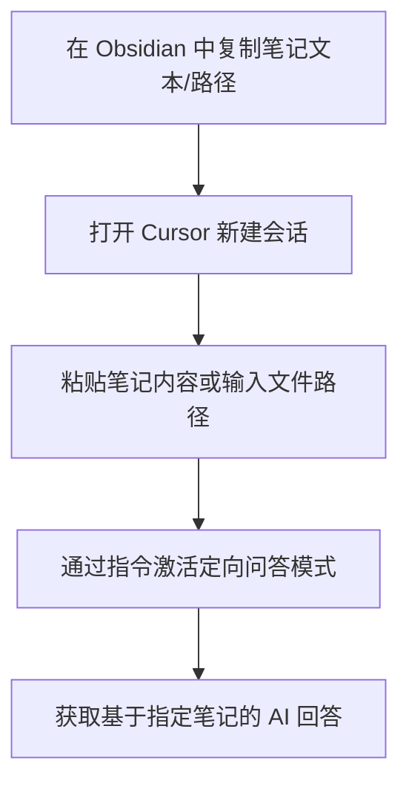

---
{"dg-publish":true,"permalink":"/Obsidian Copilot 插件配置指南：构建基于笔记内容的智能对话系统/","dgPassFrontmatter":true,"created":"2025-06-08T21:58:04.228+08:00"}
---

  
# **一、工具准备与环境搭建**

1. **核心工具与资源**
    - **硅基流动用户系统（统一登录 SSO）**
        - 官网地址：[https://cloud.siliconflow.cn/](https://cloud.siliconflow.cn/)
        - 功能定位：提供账号体系与权限管理，用于插件的身份验证与服务订阅。
    - **Copilot for Obsidian 插件**
        - 官方网站：[https://www.obsidiancopilot.com/en](https://www.obsidiancopilot.com/en)
        - 核心价值：基于人工智能技术，实现与 Obsidian 笔记内容的语义交互，辅助知识检索、内容生成与逻辑验证。

# **二、关键操作流程与最佳实践**

1. **初始化配置步骤**


2. **数据索引与模型配置**
- **索引构建**
    - 操作路径：`插件设置 → 数据管理 → 刷新库索引`
    - 作用：通过 Embedding 模型（如 OpenAI Embeddings、Hugging Face 等）将笔记内容转化为向量表示，建立语义检索数据库。
- **模型选择建议**

| 模型类型    | 适用场景         | 响应速度 | 语义理解精度 |
| ------- | ------------ | ---- | ------ |
| 轻量级本地模型 | 隐私敏感内容、离线环境  | 快    | 中      |
| 云端大型模型  | 复杂语义分析、多模态数据 | 较慢   | 高      |
3. **内容验证机制**
    - **防幻觉策略**
        - 启用插件内置的「来源追溯」功能，要求 AI 输出时附带笔记引用链接（如 `![[笔记标题#子标题]]`）。
        - 配置「置信度阈值」（如设置为 ≥70%），对低可信度回答触发二次验证流程。
    - **工作流集成**
        - 结合 Obsidian 的 `Query` 语法或 Dataview 插件，建立「AI 回答 → 笔记交叉验证」的闭环审核机制。

# **三、专业应用场景与效能提升**

1. **知识管理场景**
    
    - **文献综述辅助**：通过自然语言提问快速聚合相关笔记，生成结构化知识图谱。
    - **术语一致性检查**：基于笔记库构建领域词库，自动识别回答中的术语偏差并提示修正。
2. **创作支持场景**
    
    - **内容续写与扩写**：指定笔记段落作为上下文，生成符合知识体系的延伸内容。
    - **逻辑漏洞检测**：对复杂论证类笔记，通过 AI 反向推演识别推理链中的断点或谬误。

# **四、高级配置与性能优化**

1. **系统参数调优**
    - **向量相似度算法**：支持余弦相似度、欧氏距离等，根据笔记类型（如文本、公式、图表）动态切换匹配策略。
    - **上下文窗口设置**：针对长文档场景，可扩展至 4096 tokens 以保留完整语义语境。
2. **隐私与安全策略**
    - 选择支持本地部署的 Embedding 模型（如 `all-MiniLM-L6-v2`），避免敏感数据上传至云端。
    - 定期执行「索引清理」，对过时或涉密笔记进行向量数据脱敏处理。

- **Embedding Model**：嵌入模型，用于将非结构化数据（如文本）转换为低维稠密向量，便于计算机进行语义相似度计算。
- **AI 幻觉（AI Hallucination）**：指人工智能生成不符合事实或逻辑的内容，通过数据溯源与置信度控制可有效降低风险。

# **五、替代方案：使用 Cursor 实现笔记内容定向对话**
1. **工具定位与核心功能**
**Cursor** 是一款基于代码仓库的 AI 助手，但其「上下文感知」功能可拓展用于 Obsidian 笔记系统，实现类似 Copilot 的「指定笔记内容对话」能力。核心优势包括：
- **多文档聚焦**：支持同时导入多篇笔记作为对话上下文，避免全局索引的泛化问题；
- **代码级精准控制**：通过文件路径指定具体笔记，适合需要精细化调用特定知识的场景；
- **实时编辑联动**：AI 生成内容可直接同步至 Obsidian 笔记，简化知识迭代流程。

2. **操作流程 ：从笔记到 Cursor 对话**



4. **场景适配与对比**

| **维度**   | **Copilot for Obsidian** | **Cursor（替代方案）**    |
| -------- | ------------------------ | ------------------- |
| **数据范围** | 全局索引（需提前刷新整个库）           | 单篇 / 多篇笔记定向调用（灵活粒度） |
| **响应速度** | 依赖索引构建速度（首次较慢）           | 即时导入，快速响应           |
| **隐私控制** | 支持本地模型（敏感数据不出库）          | 需上传文本至云端（适合非涉密场景）   |
| **专业领域** | 知识管理全流程自动化               | 代码 / 文档协同编辑场景更优     |

5. **高级用法：结合 Obsidian URI 实现深度联动**
- **配置 Obsidian URI 协议**：  
    在 Cursor 中安装 [Obsidian URI 插件](https://github.com/Vinzent03/obsidian-uri)，输入指令：

    ```plaintext
    # 打开指定笔记并注入回答  
    obsidian://open?vault=你的库名称&file=笔记路径&text=AI生成内容  
    ```

- **典型工作流**：
    1. 在 Cursor 中基于笔记 A 生成分析结论；
    2. 通过 URI 协议将结论自动插入笔记 B 的「讨论」章节；
    3. Obsidian 实时更新笔记，形成「提问 - 分析 - 沉淀」闭环。

6. **注意事项**
- **文本长度限制**：Cursor 单次对话支持最大约 8000 字输入，长笔记需拆分导入；
- **格式兼容性**：Obsidian 中的特殊格式（如 LaTeX 公式、Callout 块）需提前转换为纯文本；
- **版本依赖**：确保 Cursor 更新至 v0.4.20 以上版本，以支持多文档上下文管理。

通过 Cursor 的定向调用能力，可在不依赖全局索引的前提下实现精准知识提取，尤其适合需要临时调用特定笔记内容的场景。建议与 Copilot 结合使用，构建「全局索引 + 局部精准」的混合 AI 辅助体系。
